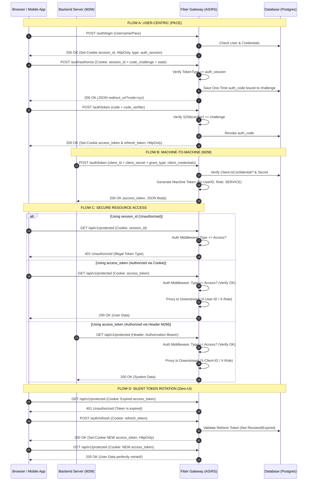

# Authentication & Authorization Flows

This document outlines the three primary security scenarios implemented within the Fiber Gateway: User-Centric PKCE Authentication, Machine-to-Machine communication, and Secure Resource Access.

