```mermaid
%%{init: {'theme': 'default', 'themeVariables': {'background': '#ffffff', 'primaryColor': '#dbeafe', 'primaryTextColor': '#1e3a5f', 'primaryBorderColor': '#3b82f6', 'lineColor': '#6b7280', 'secondaryColor': '#f0fdf4', 'tertiaryColor': '#fefce8', 'noteBkgColor': '#fef9c3', 'noteTextColor': '#713f12'}}}%%
sequenceDiagram
    autonumber
    participant WebApp  as Browser / SPA (Web)
    participant MobApp  as Native Mobile App (iOS/Android)
    participant SvcApp  as Backend Service (M2M)
    participant Gateway as Fiber Gateway (AS + RS)
    participant DB      as PostgreSQL

    %% ─────────────────────────────────────────────
    Note over WebApp, DB: FLOW A — WEB PKCE (Browser / SPA)
    %% ─────────────────────────────────────────────

    WebApp->>Gateway: POST /auth/login {username, password}
    Gateway->>DB: FindUserByUsername → bcrypt.CompareHash
    Note over Gateway: Brute-force guard: Visit++ · Locked=true after 3 failures
    Gateway-->>WebApp: 200 OK · Set-Cookie: session_id [type=auth_session, HttpOnly, IP-bound, 30d]

    WebApp->>Gateway: POST /auth/authorize · Cookie: session_id [type=auth_session]
    Note over Gateway: Validate JWT · type==auth_session · SourceIP match · client_type==web
    Gateway->>DB: INSERT auth_code (one-time, short-lived, bound to code_challenge)
    Gateway-->>WebApp: 200 OK · {redirect_uri: "https://app.com/callback?code=xyz"}

    WebApp->>Gateway: POST /auth/token {code, code_verifier, client_id}
    Note over Gateway: Verify S256(code_verifier)==code_challenge · check ExpiresAt · MarkUsed
    Gateway->>DB: SaveRefreshToken [type=refresh, IP-bound]
    Gateway-->>WebApp: 200 OK · Set-Cookie: access_token [type=access, HttpOnly] · Set-Cookie: refresh_token [type=refresh, HttpOnly]

    %% ─────────────────────────────────────────────
    Note over WebApp, DB: FLOW A2 — CROSS-DOMAIN SSO (Second App on different domain)
    %% ─────────────────────────────────────────────

    WebApp->>Gateway: GET /auth/authorize?client_id=app2&redirect_uri=https://app2.com/cb
    Note over Gateway: Browser auto-attaches Cookie: session_id [type=auth_session, still valid 30d]
    Gateway->>DB: INSERT new auth_code for app2
    Gateway-->>WebApp: 302 Found → Location: https://app2.com/cb?code=abc (zero password prompt)

    %% ─────────────────────────────────────────────
    Note over MobApp, DB: FLOW B — MOBILE PKCE (iOS / Android)
    %% ─────────────────────────────────────────────

    MobApp->>Gateway: POST /auth/login {username, password, client_id[mobile]}
    Gateway->>DB: FindUserByUsername → bcrypt.CompareHash
    Note over Gateway: client_type==mobile → IP binding disabled on session token
    Gateway-->>MobApp: 200 OK · Set-Cookie: session_id [type=auth_session, HttpOnly, no IP binding]

    MobApp->>Gateway: POST /auth/authorize · Cookie: session_id [type=auth_session] · redirect_uri: myapp://cb
    Note over Gateway: client_type==mobile → skip IP check · validate type==auth_session only
    Gateway->>DB: INSERT auth_code
    Gateway-->>MobApp: 200 OK · {redirect_uri: "myapp://callback?code=xyz"}

    MobApp->>Gateway: POST /auth/token {code, code_verifier, client_id}
    Note over Gateway: client_type==mobile → NO cookies · NO IP binding on refresh_token
    Gateway->>DB: SaveRefreshToken [type=refresh, no IP binding]
    Gateway-->>MobApp: 200 OK · Body: {access_token [type=access], refresh_token [type=refresh]}
    Note over MobApp: App stores both tokens in iOS Keychain / Android Keystore

    %% ─────────────────────────────────────────────
    Note over SvcApp, DB: FLOW C — MACHINE-TO-MACHINE (Client Credentials Grant)
    %% ─────────────────────────────────────────────

    SvcApp->>Gateway: POST /client/register {client_id, client_type: service, is_confidential: true}
    Gateway->>DB: INSERT Client · GenerateClientSecret (bcrypt-hashed)
    Gateway-->>SvcApp: 201 Created · {client_id, client_secret}

    SvcApp->>Gateway: POST /auth/token {grant_type: client_credentials, client_id, client_secret}
    Gateway->>DB: FindClientByID → VerifyClientSecret
    Note over Gateway: No UserID · Role=SERVICE · type=access embedded in JWT
    Gateway-->>SvcApp: 200 OK · Body: {access_token [type=access, role=SERVICE], expires_in}

    %% ─────────────────────────────────────────────
    Note over WebApp, Gateway: FLOW D — SECURE RESOURCE ACCESS (Multi-platform)
    %% ─────────────────────────────────────────────

    alt Web Client — Cookie transport
        WebApp->>Gateway: GET /api/v1/users/* · Cookie: access_token [type=access]
        Gateway->>Gateway: JWTMiddleware: type==access ✓ · RBAC role check ✓
        Gateway->>Gateway: ReverseProxy → upstream with X-User-ID, X-Role headers
        Gateway-->>WebApp: 200 OK (proxied response)
    else Mobile Client — Bearer header transport
        MobApp->>Gateway: GET /api/v1/users/* · Authorization: Bearer access_token [type=access]
        Gateway->>Gateway: JWTMiddleware: type==access ✓ · RBAC role check ✓
        Gateway->>Gateway: ReverseProxy → upstream with X-User-ID, X-Role headers
        Gateway-->>MobApp: 200 OK (proxied response)
    else M2M Service — Bearer header transport
        SvcApp->>Gateway: GET /api/v1/users/* · Authorization: Bearer access_token [type=access, role=SERVICE]
        Gateway->>Gateway: JWTMiddleware: type==access ✓ · role==SERVICE · RBAC allows SERVICE ✓
        Gateway->>Gateway: ReverseProxy → upstream with X-Client-ID, X-Role: SERVICE
        Gateway-->>SvcApp: 200 OK (proxied response)
    else Rejected — wrong token type
        WebApp->>Gateway: GET /api/v1/users/* · Cookie: session_id [type=auth_session]
        Gateway-->>WebApp: 401 Unauthorized · "Token is not a valid Access Token"
    end

    %% ─────────────────────────────────────────────
    Note over WebApp, DB: FLOW E — SILENT TOKEN ROTATION (Zero-UI, Web)
    %% ─────────────────────────────────────────────

    WebApp->>Gateway: GET /api/v1/users/* · Cookie: access_token [type=access, EXPIRED]
    Gateway-->>WebApp: 401 Unauthorized · "Token is expired"
    Note over WebApp: HTTP interceptor catches 401 → triggers silent refresh automatically
    WebApp->>Gateway: POST /auth/refresh · Cookie: refresh_token [type=refresh]
    Gateway->>DB: FindAvailableRefreshToken → check ExpiresAt & Revoked
    Gateway-->>WebApp: 200 OK · Set-Cookie: access_token [type=access, NEW, HttpOnly]
    WebApp->>Gateway: GET /api/v1/users/* · Cookie: NEW access_token [type=access]
    Gateway-->>WebApp: 200 OK (seamless retry · zero user interruption)

    %% ─────────────────────────────────────────────
    Note over MobApp, DB: FLOW F — SILENT TOKEN ROTATION (Zero-UI, Mobile)
    %% ─────────────────────────────────────────────

    MobApp->>Gateway: GET /api/v1/users/* · Authorization: Bearer access_token [type=access, EXPIRED]
    Gateway-->>MobApp: 401 Unauthorized · "Token is expired"
    MobApp->>Gateway: POST /auth/refresh · Authorization: Bearer refresh_token [type=refresh]
    Gateway->>DB: FindAvailableRefreshToken → check ExpiresAt & Revoked
    Note over Gateway: Authorization header detected → mobile refresh flow
    Gateway-->>MobApp: 200 OK · Body: {access_token [type=access, NEW]}
    Note over MobApp: App updates Keychain/Keystore with new access_token
    MobApp->>Gateway: GET /api/v1/users/* · Authorization: Bearer NEW access_token [type=access]
    Gateway-->>MobApp: 200 OK (seamless retry)
```

# Authentication & Authorization Architecture

Fiber Gateway acts as both an **Authorization Server (AS)** and a **Resource Server (RS)** conforming to OAuth 2.0 (RFC 6749) and PKCE (RFC 7636). This document describes all authentication and authorization flows currently implemented.

---

---

## Security Controls Summary

| Control | Mechanism | Scope |
|:---|:---|:---|
| Brute-force Protection | `Visit` counter + `Locked` flag in DB | All clients |
| XSS Prevention | `HttpOnly` cookie for all web tokens | Web only |
| IP Binding | `SourceIP` embedded in JWT, verified on each request | Web only |
| PKCE | `S256(code_verifier) == code_challenge` | Web + Mobile |
| Auth Code Replay | One-time use + `ExpiresAt` check + immediate revocation | Web + Mobile |
| M2M Secret | `bcrypt`-hashed `client_secret`, never stored in plain text | Service only |
| HTTPS Enforcement | `Secure` cookie flag via `ENV=production` | Web (production) |
| SSO Session | 30-day `session_id` JWT cookie at Gateway domain | Web + Cross-domain |
| Secure Storage | Keychain (iOS) / Keystore (Android) — enforced by app, not Gateway | Mobile |

